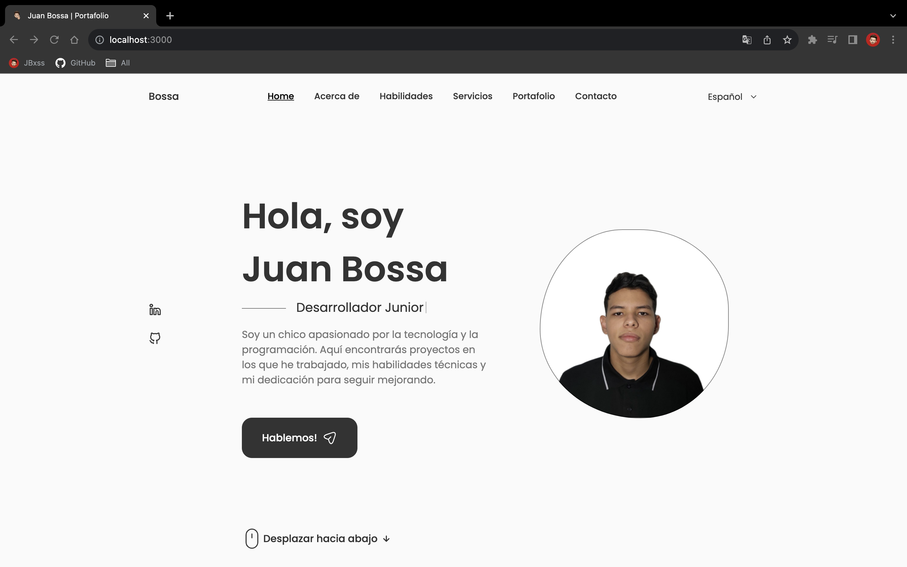
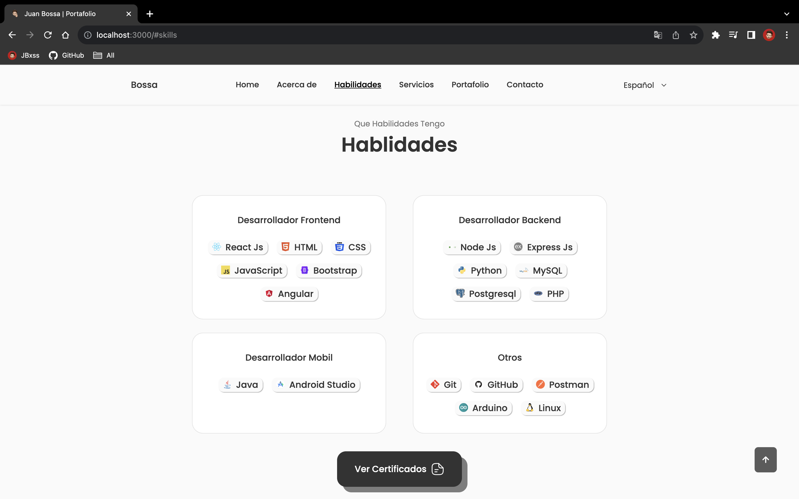
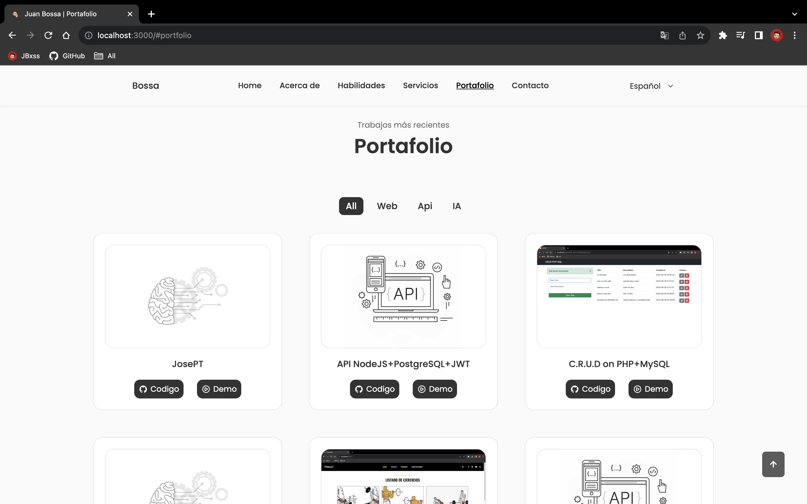

# Mi Portafolio Personal

Este es mi portafolio personal donde comparto mis proyectos y habilidades. Puedes verlo en acción [aquí](https://jbxss.github.io/).

## Tecnologías Utilizadas

- React
- CSS (sin ningún framework)
- [Typewriter.js](https://github.com/tameemsafi/typewriterjs) para animación de texto
- [SwiperJS](https://swiperjs.com/) para el apartado de los testimonios
- [EmailJS](https://www.emailjs.com/) para el formulario de contacto
- [i18next](https://www.i18next.com/) para la internacionalización y traducciones

## Capturas de Pantalla


*Página principal*


*Seccion de Habilidades*


*Seccion de Portafolio*

## Funcionalidades Destacadas

- Animación de texto en la página de inicio utilizando Typewriter.js.
- Carrousel de testimonios utilizando SwiperJS.
- Formulario de contacto con funcionalidad de envío de correo electrónico a través de EmailJS.
- Internacionalización y traducciones con i18next para llegar a una audiencia global.

## Instalación

1. Clona este repositorio:

```
git clone https://github.com/JBxss/JBxss.github.io.git
```

2. Instala las dependencias:

```
npm install
```

3. Ejecuta la aplicación en tu entorno de desarrollo local:

```
npm start
```

---

¡Gracias por visitar mi portafolio! Si tienes alguna pregunta o sugerencia, no dudes en [contactarme](https://jbxss.github.io/#contact).
